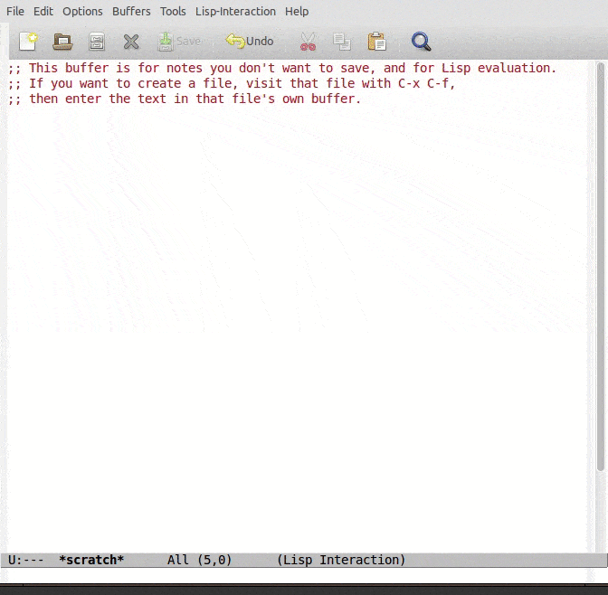
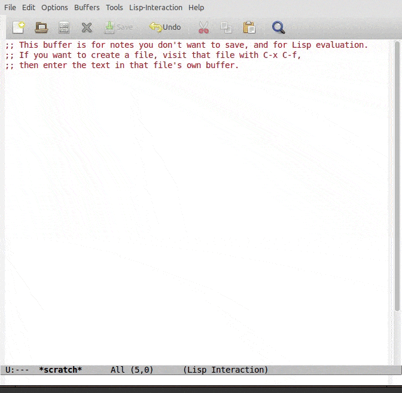
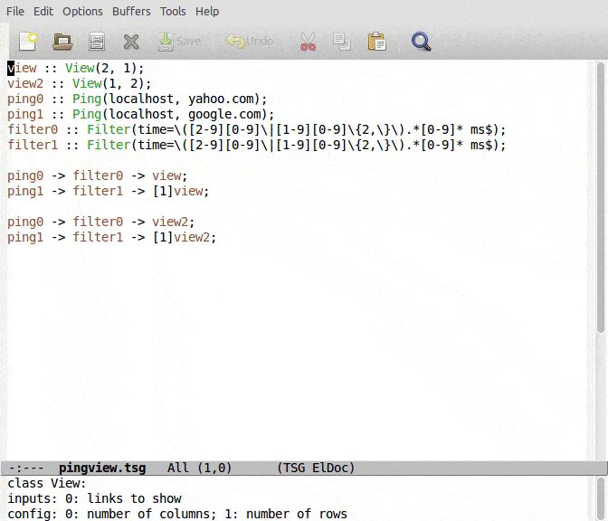

# Epoxide
A Modular Troubleshooting Framework for SDN

Epoxide is an Emacs based modular framework, which can flexibly
combine network and software troubleshooting tools in a single
platform.  Epoxide does not try to be a complex troubleshooting
software that fully integrates all available tools, but rather a
lightweight framework that allows the ad-hoc creation of tailor-made
testing methods from predefined building blocks to test
troubleshooting hypotheses.

I. Pelle, T. Lévai, F. Németh, and A. Gulyás: "One Tool to Rule Them
All: A Modular Troubleshooting Framework for SDN (and other)
Networks", ACM Sigcomm Symposium on SDN Research (SOSR), June 17-18,
2015, Santa Clara, CA.
[http://dx.doi.org/10.1145/2774993.2775014](http://dx.doi.org/10.1145/2774993.2775014)

[SIGCOMM 2015 demo video](https://www.youtube.com/watch?v=HsiGFR0QirE)

# Installation

Add the following lines to your emacs initialization file (~/.emacs):

```
  (package-initialize)
  (add-to-list 'package-archives
               '("epoxide" . "http://nemethf.github.io/epoxide/") t)
```

Then install the `epoxide` package with M-x list-packages RET.

To utilize graph visualization install `graphviz` from your
distribution's package manager or from any other source.

## Installation from the git repository

First install COGRE either from the CEDET git repository or from the
package archive of Epoxide (see above), then add the following lines
to your initialization file.

```
  (add-to-list 'load-path "path-to-the-epoxide-repository/src")
  (autoload 'epo-mode "epoxide")
  (add-to-list 'auto-mode-alist '("\\.tsg\\'" . epoxide-tsg-mode))
  (autoload 'tramp-mininet-setup "tramp-mininet")
  (eval-after-load 'tramp '(tramp-mininet-setup))
```

# Introduction

Epoxide is a tool built around the concept of connecting existing
network and software troubleshooting tools in a way that they can
transfer data among each other. To describe such scenarios we
introduce troubleshooting graphs.

## Troubleshooting graphs

Troubleshooting graphs (or TSGs in short) consist of nodes and
links. Nodes are functional elements either implementing a wrapper for
an external tool or providing entirely new functionality.  Links
connect nodes by relaying data between them.

## Emacs based prototype

We created an [Emacs](https://www.gnu.org/software/emacs/) based
prototype to illustrate how our concept works.  For defining TSGs we
use a
[Click](http://www.read.cs.ucla.edu/click/docs/language)-inspired
language and store them in `.tsg` configuration files.  The nodes are
implemented in Emacs Lisp and we chose human readable text data to be
transfered between them.

The creation, execution and manipulation of TSGs are controlled by a
framework that maps nodes and links to Emacs buffers and then helps
the data distribution among nodes.  Node buffers hold node specific
attributes and potentially display state information; while link
buffers are the inputs and the outputs of the nodes containing human
readable text data (e.g. the output buffers of the Iperf wrapper node
contain the intact output of the wrapped tool).  The framework with
the help of its event scheduler is responsible to call the execution
function of a node if one of its input buffers got modified,
afterwards it is the responsibility of the execution function to
process the input data, and to write into its output buffers.

Epoxide offers:

* *Easy extensibility*: framework and node functions are implemented
   in separate Emacs Lisp files and the framework provides a
   programming interface to node developers. This allows creating
   third party node implementations and also external node
   repositories.  Developers only have to write node initialization,
   execution, and termination functions.  Optionally, they can add
   documentation functions to provide information about node
   configuration parameters.

* *Context-aware buffer switching* keeps track of the created buffers
   and provides support to move among them in an orderly fashion by
   applying key combinations.  When multiple branches of the TSG are
   available, possible choices are offered as a selectable list, or
   they can be selected by the same key combination prefixed with the
   output link's number.  Users can also switch to buffers associated
   with the current Epoxide session by selecting from a list of buffer
   names grouped together based on their types and positions in the
   TSG.

* *TSG visualization* offers a graph representation of the interpreted
   `.tsg` file, navigation options for graph traversal, and quick
   access to node and link buffers.

* *Syntax highlighting and context-aware code completion* is provided
   for `.tsg` files.  Additional, context-aware help is also shown
   with the short documentation of the current node, in which the
   currently typed parameter is highlighted.  Intelligent code
   completion is offered: candidate lists are populated with node
   classes and phrases from other buffers.

* *Views* are special TSG elements that can create bundles of link and
   node buffers to be displayed together by splitting the Emacs window
   to different sub-windows.  In a complex TSG, views provide quick
   access to a subset of the buffers.  Moreover, in case of a long
   chain of nodes not only the final result is shown but every
   intermediate partial result is also available for inspection in the
   corresponding link buffer.

* *Run-time node creation, reconfiguration and re-linking* provides
   two possibilities to make modifications on a TSG that has already
   been started.  The first one allows reinterpreting a modified
   `.tsg` file and then reconfigures the TSG based on the
   modifications.  The second one interactively guides the user to add
   a new node or reconfigure existing nodes or links between them.

* *Customization* of major Epoxide parameters is integrated in Emacs's
   own customization interface and can be invoked via <kbd>M-x
   customize group</kbd> and then typing the `epoxide` keyword.

# Usage

Here we show how one can use Epoxide to test networks and extend it if
the available nodes aren't enough for the task at hand. If this is
your first time using Epoxide, you should read the article and watch
the video mentioned in the introduction for more in-depth information
about our tool. But do not be afraid, the learning curve of Epoxide is
not really steep if you are familiar with Emacs.

## Demonstration

To better understand how Epoxide works, a simple example is presented
that takes you through the process of creating a troubleshooting
graph, executing it and making observations during its run.

### The sample scenario

Let's assume we have a host and want to test its connectivity to the
public internet. First we want to examine if connection can be
established then we would like to measure the latency to some
well-known websites. To accomplish this, the simplest tool we can use
is ping: it tells us whether the target website is available, and if
so, the latency is displayed also.

Let's further assume that we would like to mark those measurements
where the round trip time exceeds a certain limit. To achieve this we
would need something that can process the output of ping.

### Constructing the TSG file

To set up Epoxide to perform the required tests, we have to create a
TSG file that describes the scenario as a troubleshooting
graph. Epoxide uses a Click-inspired language for describing such
graphs. Here we provide a simple one of that.  TSGs are recognized by
Emacs/Epoxide as being stored in `.tsg` files. As an example take a
look at the content of [pingview.tsg](examples/pingview.tsg).

In this simple example let's split the definition into two main logical
parts: the first is the description of nodes and views of the
troubleshooting graph and the second is the description of the links
between them.

```
// Nodes
ping0 :: Ping(localhost, yahoo.com);
ping1 :: Ping(localhost, google.com);
filter0 :: Filter(time=\([2-9][0-9]\|[1-9][0-9]\{2,\}\).*[0-9]* ms$);
filter1 :: Filter(time=\([2-9][0-9]\|[1-9][0-9]\{2,\}\).*[0-9]* ms$);
view :: View(1, 2);

// Links
ping0 -> filter0 -> view;
ping1 -> filter1 -> [1]view;
```

We define nodes for pinging yahoo.com and google.com and filters that
highlight response times longer or equal to 20 ms and a view that would
serve as a means to provide a solution for the common need to see
multiple outputs aligned at once in a simple yet flexible way. Views
can be added to TSGs as they were nodes.

A node is specified by its instance name (e.g. `ping0`) and its class
(e.g. `Ping`). A class is assigned to the instance by using the `::`
operator. Following the class declaration, node configuration parameters
can be specified in parentheses.

Links are then created that tie the nodes together. The output of a
node is connected to the input of another by adding the `->`
operator. Nodes can have multiple in/outputs, to distinguish between
these write the number of the appropriate in/output in
brackets. Outputs should be written after the instance name of the
node, inputs before them. When using the 0th in/output, you can use
the simplification of omitting the brackets and numbers
altogether. Multiple outputs can be linked to multiple inputs between
two nodes by listing the appropriate numbers separating them with
a comma (e.g. `node1[1, 2, 3] -> [4, 5, 2]node2` would link the 1st,
2nd and 3rd output of `node1` to the 4th, 5th and 2nd input of `node2`
respectively). Note: you should list equal number of outputs and
inputs.

Since views are a special kind of nodes, one can use the `->` operator
to link outputs of a node to a view. In case of a node's own buffer
contains the data of interest the `-->` operator should be
used. E.g. `node --> view` means that the `node`'s own buffer will be
displayed when switching to `view`.

An expression (instance declaration and linking) should always be
terminated by a semicolon. A node instance declaration can be written
inline in a linking expression. If you use a node only in one
expression you can omit the instance name part: by doing so the
framework will generate a unique name for this node.

It is really easy to create new TSGs or modify existing ones due to
the convenient TSG editing features of Epoxide:

* syntax highlighting that visually separates node classes and
  instances,

* Eldoc integration which provides short documentation for node
  configuration parameters,

* autocomplete support that brings intelligent code completion
  capability,

* and keyboard shortcuts for controlling the execution of the TSG and
  the nodes.

Since now we are familiar with the syntax of the TSG definition file
we can take a look at a simple execution scenario.

### Executing the TSG

Executing a TSG describing the troubleshooting process itself is as
simple as opening the corresponding `.tsg` file. For starters let's
see an even simpler scenario then described before that uses only one
Ping and one Filter node. Let's open it now by issuing <kbd>C-x C-f
~/.emacs.d/elpa/epoxide-<current version>/examples/ping.tsg
RET</kbd>. Depending on your setup the execution starts automatically
or you have to press <kbd>C-x C-e</kbd> then hit <kbd>y</kbd> at the
confirmation question to start the execution. (This behavior can be
customized in the `epoxide` customization group by changing the value
of the variable `epoxide-start-tsg-on-file-open`.) As the execution
starts, the Emacs frame splits horizontally and you can see the `.tsg`
file and the output of the last link in the TSG. Currently it is the
output of `ping` with lines emphasizing greater or equal than 20 ms
response time.

Let us suppose that we want to check the connectivity with a different
target. It is really simple to do that with Epoxide. All you have to
do is modify the second parameter of the Ping node and reevaluate the
`.tsg` file with <kbd>C-x C-e y</kbd>. (Or you can move to the node's
buffer and change the parameter using the runtime node reconfiguration
option as described later.)



At this point we have a running TSG which we want to examine. The main
purpose behind examining a TSG in details is to see the data-flow
itself and to modify node variables on-the-fly. In order to aid
traversing a TSG, Epoxide can provide a graphical representation of
the TSG by pressing <kbd>M-x t</kbd> or <kbd>C-x g</kbd>. Nodes can be
easily accessed from this view by clicking on their name or using key
bindings (<kbd>C-x p</kbd> and <kbd>C-x n</kbd>).

Every node has its own buffer where a small help is provided and the
node's variables can be accessed by pressing <kbd>v</kbd>; these
variables can be modified on-the-fly. Links between the nodes can be
altered this way also.

It is also possible to navigate through the TSG via the links. Press
<kbd>C-x n</kbd> or <kbd>M-n</kbd> to jump to the following link/node,
and <kbd>C-x p</kbd> or <kbd>M-p</kbd> to the previous one. If you
want to jump back to the `.tsg` file, press <kbd>M-g e</kbd>.



One might want to perform two pings at the same time. The
modifications of the TSG definition file to achieve this were discussed
in the previous section. Comparison of the simple case and the one
using parallel pings is left to the reader.

If there are views in a TSG, the last one will be activated at the
beginning of the execution. Other views can be activated with the
numeric prefix <kbd>M-g v</kbd> key binding, or you can cycle through
the defined views by pressing <kbd>M-p</kbd> or <kbd>M-n</kbd> as you
can see it in the animation.



## Implementing new nodes

Currently, Epoxide can only provide a limited number of predefined
nodes, therefore, cannot cover every unique use-case. On such
occasions, the functionality of Epoxide can be easily extended by
implementing new nodes. Nodes are written in [Emacs
Lisp](http://www.emacswiki.org/emacs/EmacsLisp) using some
Epoxide-specific data structures which are well-documented in the
source code.

To implement a new node the following three Epoxide framework-specific
functions have to be included in the node describing file:

- `epoxide-<nodename>-start` is called when the node initializes,

- `epoxide-<nodename>-exec` contains the function of the node, this is
  the function called by the scheduler during TSG execution,

- `epoxide-<nodename>-stop` is called when the node stops.

In these function names `<nodename>` should match the node definition
file name in all lower case letters.

Additional documentation-aiding functions can be added to a node:

- `epoxide-<nodename>-input-info` provides documentation, value hints
  and validation for input fields,

- `epoxide-<nodename>-config-info` provides documentation, value hints
  and validation for configuration fields,

- `epoxide-<nodename>-output-info` provides documentation, value hints
  and validation for output fields.

Existing node definition files are collected in `src/nodes/` but this
location can be customized by changing the value of the variable
*epoxide-nodes-files-directory*. Node definition files should be Emacs
Lisp files and their names should start with a capital letter
(e.g. *Nodename.el*).

As an example take a look at the [Ping node](src/nodes/Ping.el).

# Keyboard shortcuts

We present the full extent of the specific Epoxide key bindings here.

Troubleshooting Graph (TSG) execution:

- <kbd>C-x C-e</kbd> clears any previous information and restarts
  execution of the TSG,

- <kbd>C-c C-e</kbd> restarts the execution of the TSG but keeps
  previous information (this can be used for adding nodes and links to
  the TSG).

TSG modification:

- <kbd>C-c C-a</kbd> adds a new node to the TSG,
- <kbd>C-c C-r</kbd> restarts a node.

Navigation, views, etc:

- <kbd>v</kbd> shows the Epoxide variable list,
- <kbd>c</kbd> customizes Epoxide variables,
- <kbd>C-x C-b</kbd> shows the Epoxide specific Ibuffer list,
- <kbd>C-x g</kbd> and <kbd>M-x t</kbd> show the TSG visualization,
- <kbd>M-g e</kbd> shows the TSG file,
- <kbd>C-x n</kbd> jumps to the following node,
- <kbd>C-x p</kbd> jumps to the preceding node,
- <kbd>C-c C-o</kbd> shows every output buffers of the active node,
- <kbd>M-n</kbd> jumps to the next buffer in the TSG,
- <kbd>M-p</kbd> jumps to the previous buffer in the TSG,
- <kbd>C-[1-9] M-g v</kbd> activates View #[1-9],
- <kbd>M-N</kbd> activates the next View,
- <kbd>M-P</kbd> activates the previous View.

# Acknowledgement

The research leading to these results has received funding from the
European Union Seventh Framework Programme under grant agreement
No. 619609.  See https://www.fp7-unify.eu/
